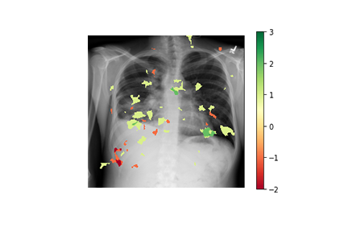

# Modifying LIME for Neural Networks on Medical Imaging

This project aims at explaining the decisions of the CheXNet model developed by [Rajpurkar (2017)](https://stanfordmlgroup.github.io/projects/chexnet/) of predicting 14 deceases using chest X-Rays. We propose two ways to 
define clinically meaningful neighbours for LIME in the medical imaging context. We also suggest three ways of applying LIME on the neighbours found.

This project was completed as part of Machine Learning for Healthcare class at MIT ([6.871/HST.956](https://mlhcmit.github.io)). Full results are available in `final_report.pdf`. Colaborators: Jiong Wei Lua, Alexandru Socolov and Andras Szep. Course support from: Matthew McDermott. Clinical Advisor: Dr. Alex Goehler. 

## Approach
We improve upon [classical LIME](https://github.com/marcotcr/lime) by defining clinically meaningful neighbours. First, we find clinically meaningful neighbours using two approaches:

1. Similarity in Variational Auto Encoder (VAE) latent space. Code available in `vae_train_and_evaluate.ipynb`. 
2. Similarity in medical reports attached to each patient using [BERT](https://arxiv.org/abs/1910.03771) embeddings. Code available in `bert_semantic_similiarity.ipynb`. 

Next, we apply LIME on the neighbouring images using three archutectures:
1. Apply classical LIME on K nearest neighbours and display them along the target input to be explained. Code in `lime_architecture1.ipynb`.
2. Apply classical LIME on K nearest neighbours, save the masks created by LIME and overlay them on top of the target input. Code in `lime_architecture2.ipynb`.
3. Segment the input image into superpixels, apply this segementation on K nearest neighbours and randomly turn superpixels on/off on the neighbors. Predict the resulting CheXNet predictions using the binary segment featurization using some simple surrogate model, e.g. logistic regression. Code in `lime_architecture3.ipynb`.

## Model to be explained
[CheXNet](https://stanfordmlgroup.github.io/projects/chexnet/) takes a chest X-Ray and outputs a probability for each of 14 deceases. The model has been shown to achieve an AUC of 0.7-0.9 on different diagnoses. It has been trained on the ChestX-ray14 dataset. To build the model, download `model.pth.tar` from [here](https://github.com/arnoweng/CheXNet) and use *load_model* function from `load_model.py`. 

## Data
Two sources are used: 

1. [MIMIC CXR from PhysioNet](https://physionet.org/content/mimic-cxr/2.0.0/) contains 377,110 images corresponding to 227,835 radiographic studies. 14 labels were extracted using two free-text methods. **Advantage**: has medical records attached to each image which enables applying NLP techniques i.e. BERT. **How to use**: download the [data](https://physionet.org/content/mimic-cxr/2.0.0/) and place lables in `.files/labels` and first 10k images in `.files/p10` or create more folders if you want to use data from folders p11 onwards.

2. [ChestX-ray14 from NIH](https://nihcc.app.box.com/v/ChestXray-NIHCC) has 112,120 frontal-view chest X-ray images of 30,805 unique patients. 14 labels extracted using two free-text methods. **Advantage**: has a pretrained CheXNet model freely available. We use ChestX-ray14 images to train the VAE. **How to use**: download the [data](https://nihcc.app.box.com/v/ChestXray-NIHCC) and place it in `./files/chex-ray-14`. 
